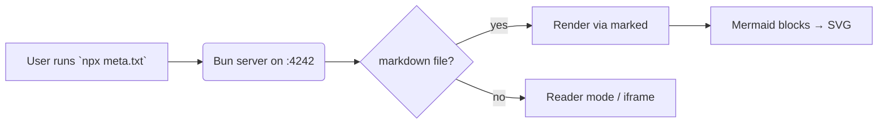
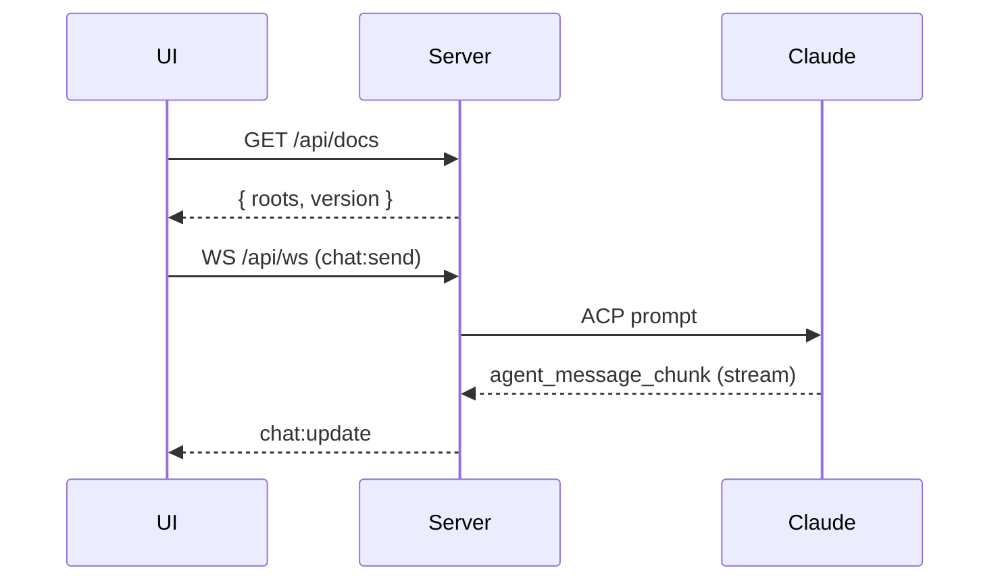
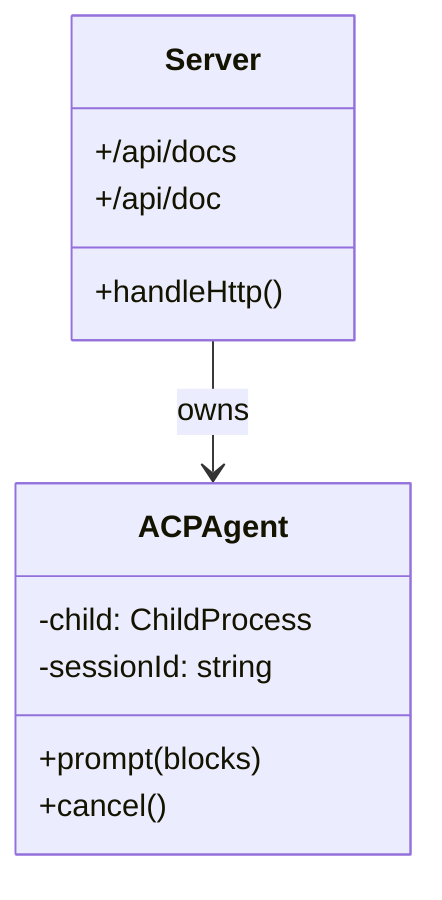
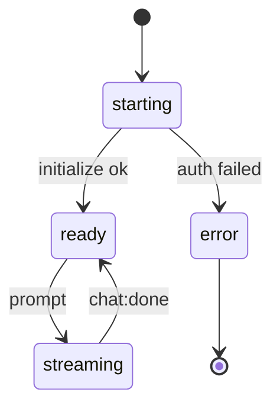
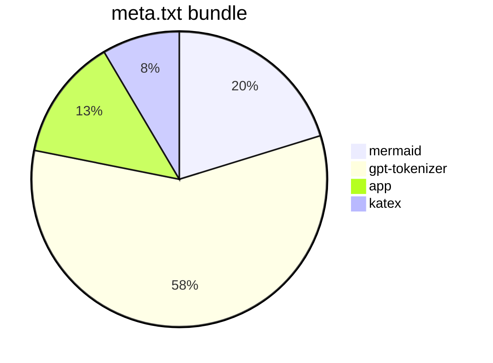
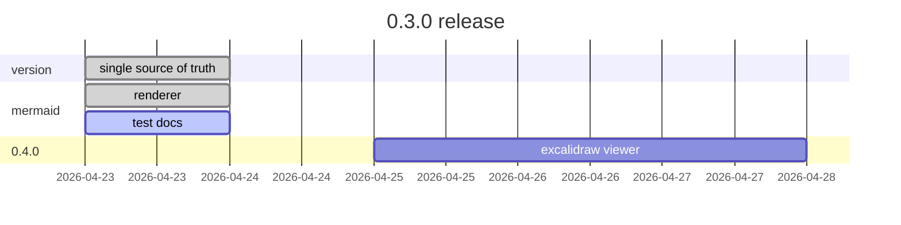

# Mermaid (`.md`)

A few fenced ` ```mermaid ` blocks below. They should render to SVG
inline, themed to match the app (dark by default).

## Flowchart



## Sequence



## Class diagram



## State



## Pie



## Gantt



## Broken block (should show error, not crash)

```mermaid
this is not valid mermaid syntax
```

## Inline sanity

Regular paragraph after the blocks — should still render normally, with
plain code fences still formatted as code:

```ts
const VERSION = "0.3.0";
```

And a standard inline `mermaid` word should **not** trigger rendering —
only fenced blocks with the `mermaid` language tag do.
