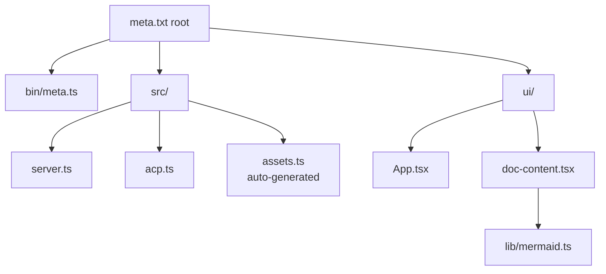
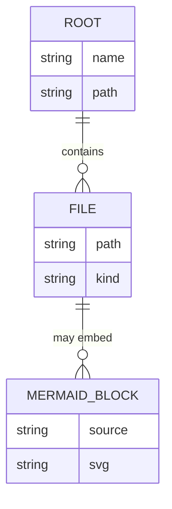
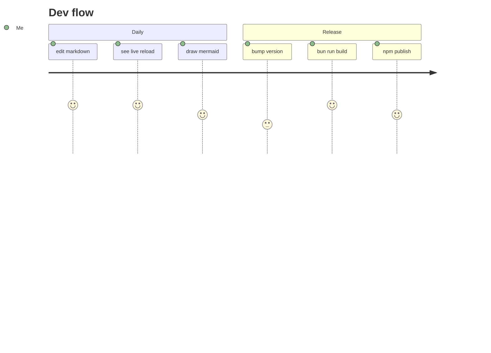
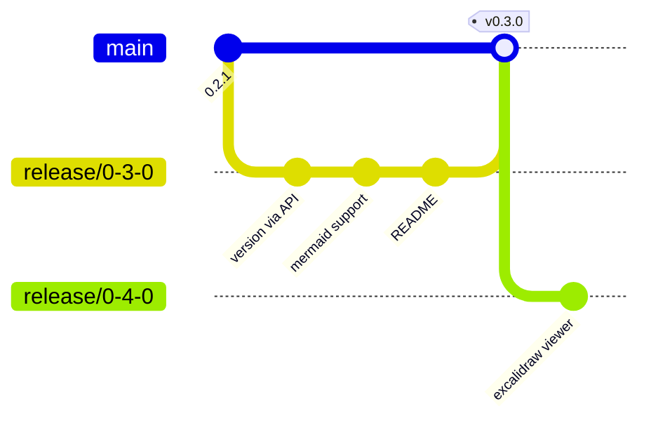

# Mermaid in `.mdx`

`meta.txt` treats `.mdx` the same as `.md` in the viewer (frontmatter
shows as-is, since we don't parse MDX components). Mermaid fences work
identically.

## Graph

## ER

## Journey

## Git graph

## Prose around it

This paragraph sits between diagrams to make sure spacing, margins, and
the centered-svg layout of `.mermaid-block` look right alongside text.
